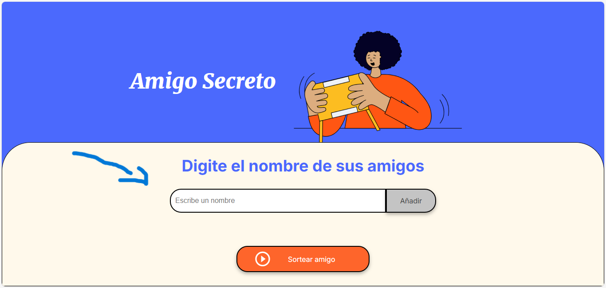
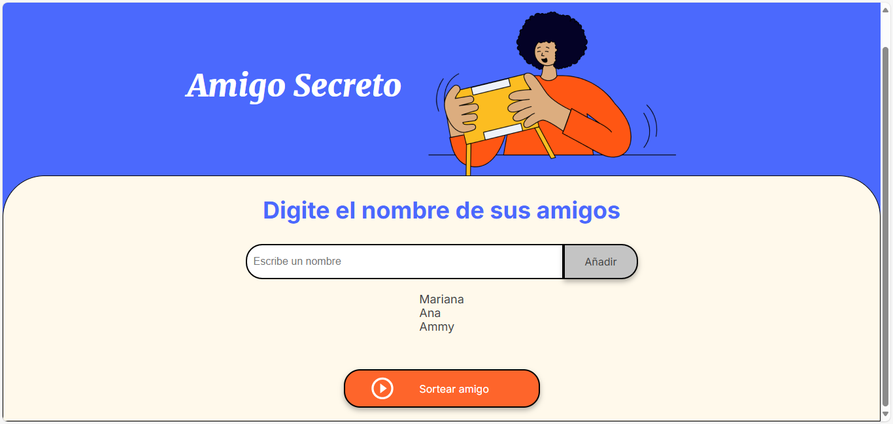
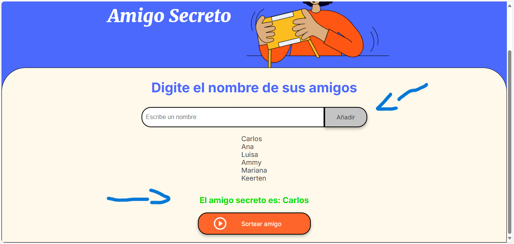

# Amigo Secreto 🎁

¡Bienvenido a la aplicación **Amigo Secreto**! Esta aplicación te permite organizar un sorteo de amigos secretos de manera fácil y divertida. Simplemente ingresa los nombres de tus amigos, realiza el sorteo y descubre quién es el amigo secreto de cada uno.

## Características ✨

- **Agregar amigos**: Ingresa los nombres de tus amigos en la lista.
- **Sorteo aleatorio**: Realiza un sorteo justo para elegir al amigo secreto.
- **Interfaz sencilla**: Diseño intuitivo y fácil de usar.

## Capturas de pantalla 🖼️







## Cómo usar 🚀

1. **Clona el repositorio**:
   ```bash
   git clone https://github.com/CarlosOtero2/Amigo-Secreto.git
   cd Amigo-Secreto

   Tecnologías utilizadas 🛠️
HTML: Estructura de la aplicación.

CSS: Estilos y diseño responsive.

JavaScript: Lógica para agregar amigos y realizar el sorteo.

Estructura del proyecto 📂
challenge-amigo-secreto_esp-main/
├── index.html          # Archivo principal de la aplicación
├── style.css           # Estilos CSS
├── app.js              # Lógica de la aplicación en JavaScript
├── assets/             # Carpeta de imágenes y recursos
│   ├── amigo-secreto.png
│   ├── play_circle_outline.png
│   └── screenshot1.png
└── README.md           # Este archivo


